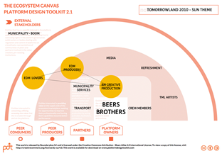

# Identifying roles of platform participants

Now that the narrative is clear, it is important to recognize what roles the identified entities play in the ecosystem. What values and motivations do they seek .  
For this, a description of the roles that are present in an ecosystem is necessary. At this point it is important to know that most of the time entities are not individuals. They can be companies or organizations, teams or groups with specific goals and operating as a whole. Moreover, sometimes one entity might play two roles in your platform, so you will need to annotate both.

### Overview of **Platform participants** 

* **Platform Owner** – Players who own the vision behind the realization of the market and ensure that the platform exists.
* **Stakeholders** – Entities that have a specific interest in platform success or failure, in controlling platform externalities and outcomes.
* **Partners** – Professional entities that seek to create additional professional value and to collaborate with the platform owners with a stronger relationship.
* **Peer producers** – Entities interested in providing value on the supply side of the ecosystem/marketplace, seeking for a better performance.
* **Peer consumers** – Entities interested in consuming, utilizing, accessing the value that is created through and on the platform.

### How to use the Ecosystem Canvas

Use the Ecosystem Canvas to map all the roles in an ecosystem. In the canvas the “larger circles” mean that one group is likely to be larger \(eg: consumers\) than another. Also, the closer a group is to the owners, the more strategic the collaboration is between the two.

* Download the Ecosystem Canvas from [https://platformdesigntoolkit.com/toolkit/\#download](https://platformdesigntoolkit.com/toolkit/#download)

* Use the selected opportunity in the “Window to Awareness Model” as the starting point of this activity. Identify the entities that are in that constellation.
* Start out with the platform owner.. Write down the name of the Platform owner on a post-it and place it in the middle of the canvas in the Platform Owner lane.
* Look at the different participants in the constellation; Who is playing what role. Write down the names of the participants on different post-its and put them in the right lane.To understand the real ecosystem dynamics, focus on the Partner, Peer Producers and Peer Consumers. For now disregard the Stakeholders.

* Limit the number of participants on the canvas by clustering them or selecting the most relevant participants. At the end of this step, maximum 5 participants should be visible on the canvas 

* Visualize possible interactions between the participants, by drawing a line between the involved participants.  All these potential interactions are opportunities to mobilize the platform

